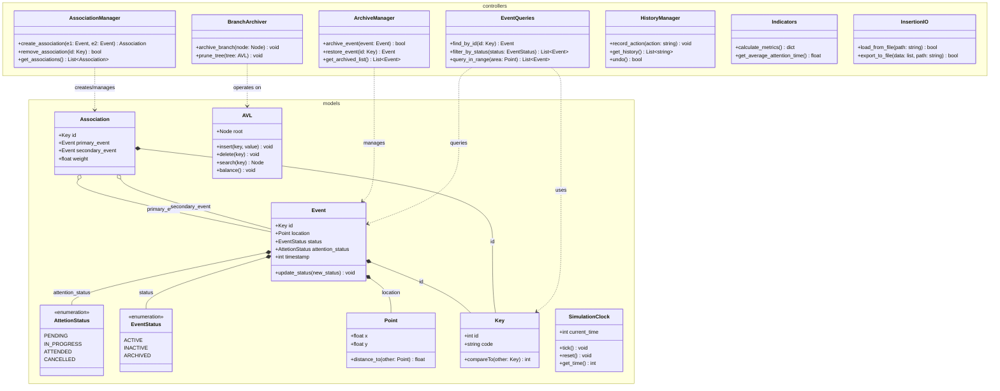

```mermaid
classDiagram
    %% --- MODELS ---
    namespace models {
        class AttetionStatus {
            <<enumeration>>
            PENDING
            IN_PROGRESS
            ATTENDED
            CANCELLED
        }

        class EventStatus {
            <<enumeration>>
            ACTIVE
            INACTIVE
            ARCHIVED
        }

        class Point {
            +float x
            +float y
            +distance_to(other: Point) float
        }

        class Key {
            +int id
            +string code
            +compareTo(other: Key) int
        }

        class SimulationClock {
            +int current_time
            +tick() void
            +reset() void
            +get_time() int
        }

        class Event {
            +Key id
            +Point location
            +EventStatus status
            +AttetionStatus attention_status
            +int timestamp
            +update_status(new_status) void
        }

        class Association {
            +Key id
            +Event primary_event
            +Event secondary_event
            +float weight
        }

        class AVL {
            +Node root
            +insert(key, value) void
            +delete(key) void
            +search(key) Node
            +balance() void
        }
    }

    %% --- CONTROLLERS ---
    namespace controllers {
        class ArchiveManager {
            +archive_event(event: Event) bool
            +restore_event(id: Key) Event
            +get_archived_list() List~Event~
        }

        class AssociationManager {
            +create_association(e1: Event, e2: Event) Association
            +remove_association(id: Key) bool
            +get_associations() List~Association~
        }

        class BranchArchiver {
            +archive_branch(node: Node) void
            +prune_tree(tree: AVL) void
        }

        class EventQueries {
            +find_by_id(id: Key) Event
            +filter_by_status(status: EventStatus) List~Event~
            +query_in_range(area: Point) List~Event~
        }

        class HistoryManager {
            +record_action(action: string) void
            +get_history() List~string~
            +undo() bool
        }

        class Indicators {
            +calculate_metrics() dict
            +get_average_attention_time() float
        }

        class InsertionIO {
            +load_from_file(path: string) bool
            +export_to_file(data: list, path: string) bool
        }
    }

    %% --- RELATIONS ---
    Event *-- Point : location
    Event *-- Key : id
    Event *-- EventStatus : status
    Event *-- AttetionStatus : attention_status

    Association *-- Key : id
    Association o-- Event : primary_event
    Association o-- Event : secondary_event

    ArchiveManager ..> Event : manages
    AssociationManager ..> Association : creates/manages
    BranchArchiver ..> AVL : operates on
    EventQueries ..> Event : queries
    EventQueries ..> Key : uses
```
